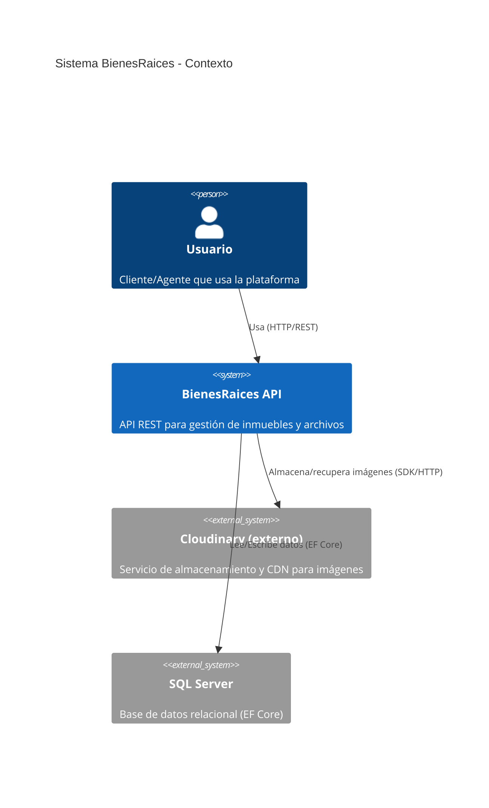
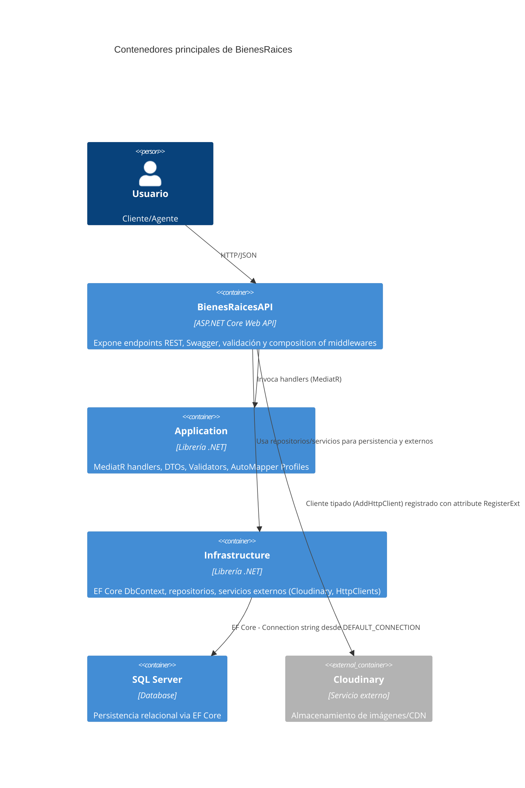
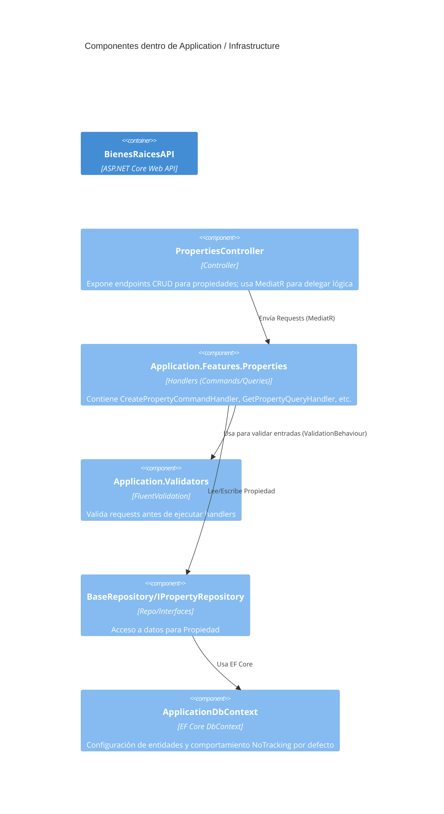
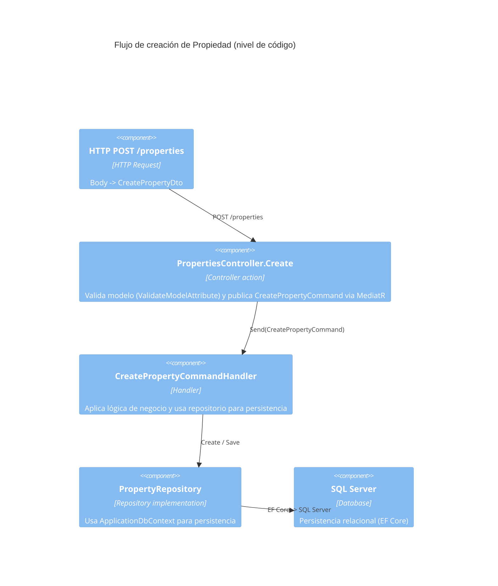
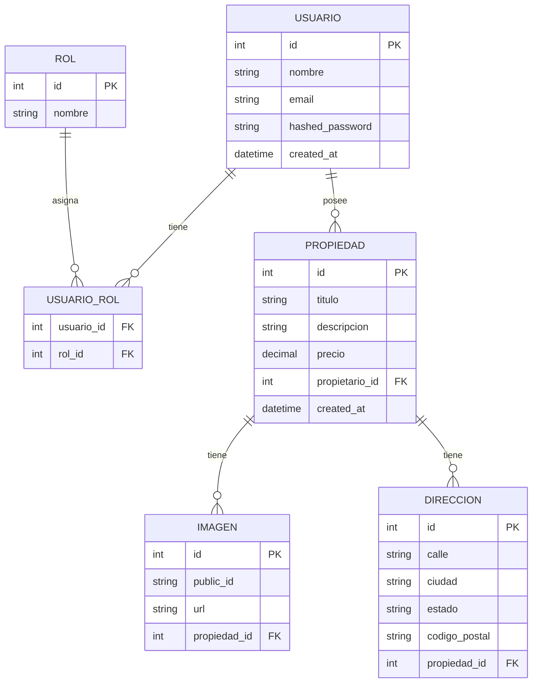

# BienesRaices — Documentación de la solución

Este repositorio es una solución ASP.NET Core Web API en capas para gestión de bienes raíces. El README resume la arquitectura, cómo ejecutar el proyecto, las variables de entorno necesarias y provee los diagramas C4 (4 niveles) y el modelo entidad-relación (MER) en notación Mermaid.

## Resumen y arquitectura (alto nivel)

La solución sigue una separación en proyectos por responsabilidad:

- BienesRaicesAPI/ — Capa HTTP (Controllers, Filters, Middlewares, Swagger).
- Application/ — Lógica de aplicación: MediatR (Requests/Handlers), FluentValidation (Validators), AutoMapper (Profiles), Behaviours (pipeline).
- Infrastructure/ — Persistencia (EF Core DbContext), repositorios, servicios de plataforma, clientes HTTP externos.
- Domain/ — Entidades de dominio y modelos.

El registro de servicios y wiring se realiza principalmente por escaneo de ensamblados y atributos personalizados (ver sección "Convenciones" más abajo).

## Convenciones clave para desarrolladores y agentes

- Registro de servicios: Se usa atributos personalizados (`[RegisterService]`, `[RegisterExternalService]`) localizados en `Application/Attributes/Services/`. Evita añadir wiring manual cuando exista el patrón por atributos.
- MediatR: Coloca Requests/Handlers en `Application/Features/*`. `Application/ServiceExtension.cs` descubre handlers, validators y perfiles.
- Responses: La API usa `WrapperResponse<T>` para respuestas uniformes. El filtro `ValidateModelAttribute` normaliza los errores de validación.
- Middleware: La composición se encuentra en `Program.cs` y `BienesRaicesAPI/Extensions/AppExtension.cs`. Los middlewares de errores incluyen `ErrorHandlerMiddleware` y `NotFoundMiddleware`.

## Variables de entorno (obligatorias para ejecución)

Las variables se extraen desde `BienesRaicesAPI/Extensions/ConfigureSettingsExtension.cs`. A continuación la lista y descripción (nombre, propósito y ejemplo):

- `API_KEY` — Clave de la API (usada para autenticación/firmas internas). Ej: `MySuperSecretApiKey`.
- `CORS_POLICY_NAME` — Nombre de la política CORS registrada. Ej: `AllowLocalhost`.
- `CORS_ORIGIN` — Origen permitido para CORS. Ej: `http://localhost:3000`.
- `DEFAULT_CONNECTION` — Connection string a la base de datos SQL Server. Ej: `Server=.;Database=BienesRaicesDb;Trusted_Connection=True;`.
- `DB_TIMEOUT_IN_MINUTES` — Timeout de comandos para EF Core (número entero). Ej: `2`.
- `CLOUDINARY_CLOUD_NAME` — Cloud name para Cloudinary (almacenamiento de imágenes).
- `CLOUDINARY_API_KEY` — API key de Cloudinary.
- `CLOUDINARY_API_SECRET` — API secret de Cloudinary.

Recomendación: durante desarrollo local, crea un archivo `.env` o config local (no lo subas al repo) y usa herramientas como `direnv`/variables de entorno en tu IDE o launchSettings.json para inyectarlas.

## Cómo ejecutar (desarrollo, desde la raíz del repo)

PowerShell (Windows):

```powershell
# Compilar la solución
dotnet build BienesRaices.sln

# Ejecutar API localmente (usa launchSettings si existe)
dotnet run --project BienesRaicesAPI/ --urls "http://localhost:5000"

# Ejecutar tests
dotnet test BienesRaices.sln
```

Asegúrate de haber configurado las variables de entorno listadas anteriormente.

## Diagramas en Mermaid

A continuación están incluidos los diagramas en notación Mermaid. Puedes visualizar estos bloques en visores que soporten Mermaid o en GitHub si activas la preview.

### Diagrama C4 - Nivel 1 (System Context)



### Diagrama C4 - Nivel 2 (Container)



### Diagrama C4 - Nivel 3 (Component)



### Diagrama C4 - Nivel 4 (Code / Ejemplo de flujo)



> Nota: los nombres de componentes son representativos y se basan en las convenciones del proyecto (`Application/Features/Properties`, `Infrastructure/Repositories`).

### Diagrama MER (Entidad-Relación) — Notación Mermaid



Este MER es una propuesta basada en los artefactos y convenciones del proyecto (nombres en español para claridad). Adapta campos concretos a las entidades reales en `Domain/Entities`.

## Buenas prácticas y notas finales

- Mantén la convención de atributos para registrar servicios. Revisa `Infrastructure/ServiceExtension.cs` antes de tocar wiring manual.
- Añade validators (FluentValidation) para todas las requests y ubícalos en `Application/Features/.../Validators` para que el escaneo los registre.
- Las respuestas deben usar `WrapperResponse<T>`; los controllers usan el filtro `ValidateModelAttribute` para errores de validación.
- Tests: colocar pruebas por capa en los proyectos de tests (`*.Tests`) y revisa los binarios/output en `*/bin/Debug`.
