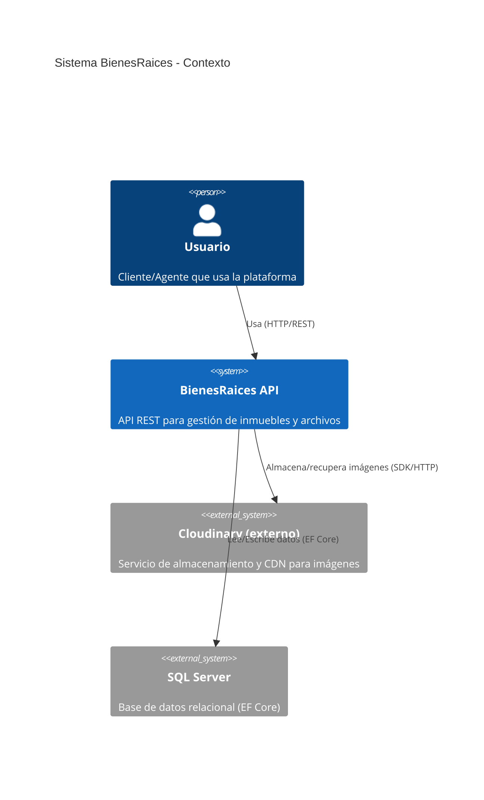
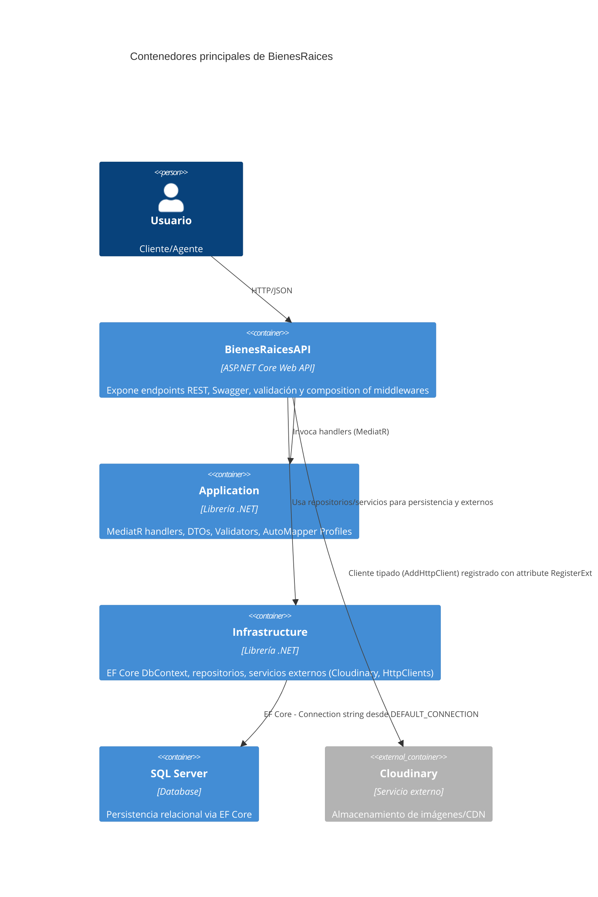
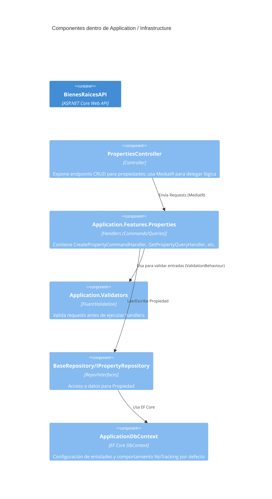
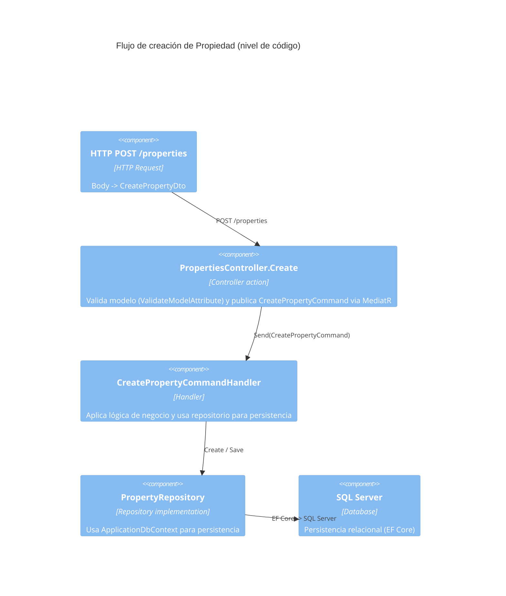
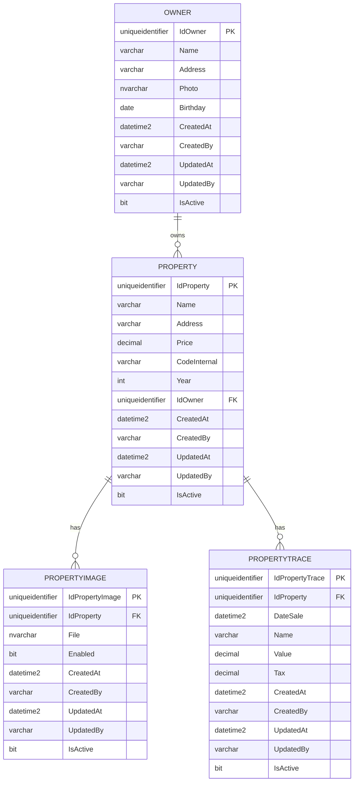

# BienesRaices — Documentación del Proyecto

## Resumen del Proyecto
BienesRaices es una solución ASP.NET Core Web API diseñada para la gestión de bienes raíces. La arquitectura sigue un enfoque en capas, separando responsabilidades en los siguientes proyectos:

- **BienesRaicesAPI/**: Capa HTTP que incluye controladores, middlewares, filtros y configuración de Swagger.
- **Application/**: Contiene la lógica de negocio, incluyendo MediatR (handlers), DTOs, validaciones (FluentValidation) y perfiles de AutoMapper.
- **Infrastructure/**: Maneja la persistencia con EF Core, repositorios genéricos y servicios externos.
- **Domain/**: Define las entidades y modelos del dominio.

El proyecto utiliza patrones como inyección de dependencias, registro automático de servicios mediante atributos y un enfoque modular para facilitar la escalabilidad.

---

## Instrucciones para Ejecutar la Aplicación

### Requisitos Previos
- .NET SDK 9.0 o superior.
- SQL Server para la base de datos.
- Configurar las siguientes variables de entorno:

| Variable              | Descripción                                      | Ejemplo                                   |
|-----------------------|--------------------------------------------------|-------------------------------------------|
| `API_KEY`             | Clave de la API para autenticación.             | `MySuperSecretApiKey`                     |
| `CORS_POLICY_NAME`    | Nombre de la política CORS.                     | `AllowLocalhost`                          |
| `CORS_ORIGIN`         | Origen permitido para CORS.                     | `*`                   |
| `DEFAULT_CONNECTION`  | Cadena de conexión a la base de datos.          | `Server=.;Database=BienesRaicesDb;...`    |
| `DB_TIMEOUT_IN_MINUTES` | Timeout para comandos de EF Core.             | `5`                                       |
| `CLOUDINARY_CLOUD_NAME` | Nombre del servicio Cloudinary.               |                                           |
| `CLOUDINARY_API_KEY`  | API key de Cloudinary.                          |                                           |
| `CLOUDINARY_API_SECRET` | API secret de Cloudinary.                     |                                           |

### Pasos para Ejecutar

1. Configurar las variables de entorno.

2. Compilar la solución:
   ```powershell
   dotnet build BienesRaices.sln
   ```

3. Ejecutar la API localmente:
   ```powershell
   dotnet run --project BienesRaicesAPI/ --urls "http://localhost:5000"
   ```

4. Ejecutar los tests:
   ```powershell
   dotnet test BienesRaices.sln
   ```

---

## Documentación Técnica

### Diagramas C4

#### Nivel 1: Contexto del Sistema


#### Nivel 2: Contenedores


#### Nivel 3: Componentes


#### Nivel 4: Flujo de Código


### Diagrama MER (Entidad-Relación) — Notación Mermaid




---

## Documentación Funcional

### Flujo de Uso
1. **Crear Propiedad**: El usuario envía un POST a `/properties` con los datos de la propiedad.
2. **Validación**: El sistema valida los datos usando FluentValidation.
3. **Persistencia**: La propiedad se guarda en la base de datos usando EF Core.
4. **Respuesta**: El sistema devuelve un `WrapperResponse` con el resultado.

---

### Script SQL para la Base de Datos

A continuación, se incluye el script SQL para la creación y configuración de la base de datos `LuxuryPropertiesDB`:

```sql
-- Script para la base de datos LuxuryPropertiesDB
USE [LuxuryPropertiesDB]
GO

-- Tabla: Owner
CREATE TABLE [dbo].[Owner](
	[IdOwner] [uniqueidentifier] NOT NULL,
	[Name] [varchar](150) NOT NULL,
	[Address] [varchar](300) NULL,
	[Photo] [nvarchar](max) NULL,
	[Birthday] [date] NULL,
	[CreatedAt] [datetime2](7) NOT NULL,
	[CreatedBy] [varchar](100) NOT NULL,
	[UpdatedAt] [datetime2](7) NULL,
	[UpdatedBy] [varchar](100) NULL,
	[IsActive] [bit] NOT NULL,
PRIMARY KEY CLUSTERED ([IdOwner] ASC)
) ON [PRIMARY] TEXTIMAGE_ON [PRIMARY]
GO

-- Tabla: Property
CREATE TABLE [dbo].[Property](
	[IdProperty] [uniqueidentifier] NOT NULL,
	[Name] [varchar](200) NOT NULL,
	[Address] [varchar](300) NOT NULL,
	[Price] [decimal](18, 2) NOT NULL,
	[CodeInternal] [varchar](50) NOT NULL,
	[Year] [int] NULL,
	[IdOwner] [uniqueidentifier] NOT NULL,
	[CreatedAt] [datetime2](7) NOT NULL,
	[CreatedBy] [varchar](100) NOT NULL,
	[UpdatedAt] [datetime2](7) NULL,
	[UpdatedBy] [varchar](100) NULL,
	[IsActive] [bit] NOT NULL,
PRIMARY KEY CLUSTERED ([IdProperty] ASC)
) ON [PRIMARY]
GO

-- Tabla: PropertyImage
CREATE TABLE [dbo].[PropertyImage](
	[IdPropertyImage] [uniqueidentifier] NOT NULL,
	[IdProperty] [uniqueidentifier] NOT NULL,
	[File] [nvarchar](max) NULL,
	[Enabled] [bit] NOT NULL,
	[CreatedAt] [datetime2](7) NOT NULL,
	[CreatedBy] [varchar](100) NOT NULL,
	[UpdatedAt] [datetime2](7) NULL,
	[UpdatedBy] [varchar](100) NULL,
	[IsActive] [bit] NOT NULL,
PRIMARY KEY CLUSTERED ([IdPropertyImage] ASC)
) ON [PRIMARY] TEXTIMAGE_ON [PRIMARY]
GO

-- Tabla: PropertyTrace
CREATE TABLE [dbo].[PropertyTrace](
	[IdPropertyTrace] [uniqueidentifier] NOT NULL,
	[IdProperty] [uniqueidentifier] NOT NULL,
	[DateSale] [datetime2](7) NOT NULL,
	[Name] [varchar](200) NOT NULL,
	[Value] [decimal](18, 2) NOT NULL,
	[Tax] [decimal](18, 2) NULL,
	[CreatedAt] [datetime2](7) NOT NULL,
	[CreatedBy] [varchar](100) NOT NULL,
	[UpdatedAt] [datetime2](7) NULL,
	[UpdatedBy] [varchar](100) NULL,
	[IsActive] [bit] NOT NULL,
PRIMARY KEY CLUSTERED ([IdPropertyTrace] ASC)
) ON [PRIMARY]
GO

-- Relaciones entre tablas
ALTER TABLE [dbo].[Property]  WITH CHECK ADD  CONSTRAINT [FK_Property_Owner] FOREIGN KEY([IdOwner])
REFERENCES [dbo].[Owner] ([IdOwner])
GO
ALTER TABLE [dbo].[PropertyImage]  WITH CHECK ADD  CONSTRAINT [FK_PropertyImage_Property] FOREIGN KEY([IdProperty])
REFERENCES [dbo].[Property] ([IdProperty])
GO
ALTER TABLE [dbo].[PropertyTrace]  WITH CHECK ADD  CONSTRAINT [FK_PropertyTrace_Property] FOREIGN KEY([IdProperty])
REFERENCES [dbo].[Property] ([IdProperty])
GO

-- Índices y valores predeterminados
ALTER TABLE [dbo].[Property] ADD UNIQUE NONCLUSTERED ([CodeInternal] ASC)
GO
ALTER TABLE [dbo].[Owner] ADD  DEFAULT (newid()) FOR [IdOwner]
GO
ALTER TABLE [dbo].[Owner] ADD  DEFAULT (sysutcdatetime()) FOR [CreatedAt]
GO
ALTER TABLE [dbo].[Owner] ADD  DEFAULT ((1)) FOR [IsActive]
GO
ALTER TABLE [dbo].[Property] ADD  DEFAULT (newid()) FOR [IdProperty]
GO
ALTER TABLE [dbo].[Property] ADD  DEFAULT (sysutcdatetime()) FOR [CreatedAt]
GO
ALTER TABLE [dbo].[Property] ADD  DEFAULT ((1)) FOR [IsActive]
GO
ALTER TABLE [dbo].[PropertyImage] ADD  DEFAULT (newid()) FOR [IdPropertyImage]
GO
ALTER TABLE [dbo].[PropertyImage] ADD  DEFAULT ((1)) FOR [Enabled]
GO
ALTER TABLE [dbo].[PropertyImage] ADD  DEFAULT (sysutcdatetime()) FOR [CreatedAt]
GO
ALTER TABLE [dbo].[PropertyImage] ADD  DEFAULT ((1)) FOR [IsActive]
GO
ALTER TABLE [dbo].[PropertyTrace] ADD  DEFAULT (newid()) FOR [IdPropertyTrace]
GO
ALTER TABLE [dbo].[PropertyTrace] ADD  DEFAULT (sysutcdatetime()) FOR [CreatedAt]
GO
ALTER TABLE [dbo].[PropertyTrace] ADD  DEFAULT ((1)) FOR [IsActive]
GO

-- Datos de ejemplo
INSERT [dbo].[Owner] ([IdOwner], [Name], [Address], [Photo], [Birthday], [CreatedAt], [CreatedBy], [UpdatedAt], [UpdatedBy], [IsActive]) 
VALUES (N'abf521d1-83f2-4a73-0c8e-08de053b621e', N'Richard Dawn', N'cra 2a', N'https://res.cloudinary.com/dbuoi70ms/image/upload/v1759798173/productos/xkastutr3btgmxzzbh9z.jpg', CAST(N'1985-07-05' AS Date), CAST(N'2025-10-06T19:49:34.2685868' AS DateTime2), N'System', CAST(N'2025-10-07T00:49:34.2721276' AS DateTime2), N'System', 1)
GO
INSERT [dbo].[Owner] ([IdOwner], [Name], [Address], [Photo], [Birthday], [CreatedAt], [CreatedBy], [UpdatedAt], [UpdatedBy], [IsActive]) 
VALUES (N'52afe350-440d-4262-9b2e-9196b134a07e', N'Juan Pérez', N'Calle 123 #45-67, Bogotá', NULL, CAST(N'1985-06-15' AS Date), CAST(N'2025-09-30T19:49:45.7900524' AS DateTime2), N'AdminUser', NULL, NULL, 1)
GO
-- Más datos de ejemplo pueden ser añadidos aquí.
```

> Nota: Este script está diseñado para ser ejecutado en SQL Server Management Studio (SSMS) o herramientas similares. Asegúrate de configurar correctamente la base de datos antes de ejecutarlo.

---

Para más detalles, consulta los archivos fuente y las pruebas en `*.Tests`.
